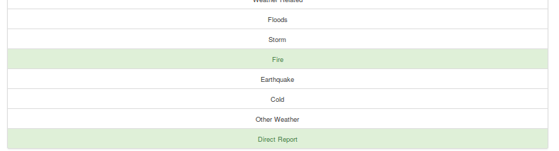

# Disaster Response Pipeline Project


## Description

This Project is part of Data Scientist Nanodegree Program by Udacity, and the training data is provided by Figure Eight.
The data set contains real messages that were sent during disaster events. 
The aim of the project is to build a Natural Language Processing tool that classify messages input by users on a webpage.

The Project is divided in the following Sections:

1. An ETL script to extract data from source, clean data and save them a sqllite db.
2. A Machine Learning script to train a multi-label classification model using the disaster messages and their labeled categories.   
3. A web page that lets users to enter messages to classify. 

## Getting Started

### Dependencies
* Python 3.7
* NumPy 1.12.1 
* SciPy 1.2.1
* Pandas 0.23.3
* Sciki-Learn 0.19.1
* NLTK 3.2.5
* SQLalchemy 1.1.13
* Flask 0.12.2
* Plotly 2.0.15

### Installing
Clone this GIT repository:
```
git clone https://github.com/HaoyangLiHarrison/disaster-response.git
```

### Files
```
├── app
│   ├── run.py------------------------# FLASK FILE THAT RUNS APP
│   ├── static
│   │   └── favicon.ico---------------# FAVICON FOR THE WEB APP
│   └── templates
│       ├── go.html-------------------# CLASSIFICATION RESULT PAGE OF WEB APP
│       └── master.html---------------# MAIN PAGE OF WEB APP
├── data
│   ├── DisasterResponse.db-----------# DATABASE TO SAVE CLEANED DATA TO
│   ├── disaster_categories.csv-------# DATA TO PROCESS
│   ├── disaster_messages.csv---------# DATA TO PROCESS
│   └── process_data.py---------------# PERFORMS ETL PROCESS
├── img-------------------------------# PLOTS FOR USE IN README AND THE WEB APP
├── models
│   └── train_classifier.py-----------# PERFORMS CLASSIFICATION TASK
```

### Executing Program:
1. Run the following commands in the project's root directory to set up your database and model.

    - To run ETL pipeline that cleans data and stores in database
        `python data/process_data.py data/disaster_messages.csv data/disaster_categories.csv data/DisasterResponse.db`
    - To run ML pipeline that trains classifier and saves
        `python models/train_classifier.py data/DisasterResponse.db models/classifier.pkl`

2. Run the following command in the app's directory to run your web app.
    `python run.py`

3. Go to http://0.0.0.0:3001/


### Additional Material

In the **data** and **models** folder you can find two jupyter notebook that will help you understand how the model works step by step:
1. **ETL Preparation Notebook**: learn everything about the implemented ETL pipeline
2. **ML Pipeline Preparation Notebook**: look at the Machine Learning Pipeline developed with NLTK and Scikit-Learn

You can use **ML Pipeline Preparation Notebook** to re-train the model or tune it through a dedicated Grid Search section. 


## License
[](https://opensource.org/licenses/MIT)

## Acknowledgements

* [Udacity](https://www.udacity.com/) for providing this great project idea
* [Figure Eight](https://www.figure-eight.com/) for providing training data

## Screenshots

1. This is an example of a message you can type to test Machine Learning model performance


2. After clicking **Classify Message**, you can see the categories which the message belongs to highlighted in green



3. The main page shows some graphs about training dataset, provided by Figure Eight

